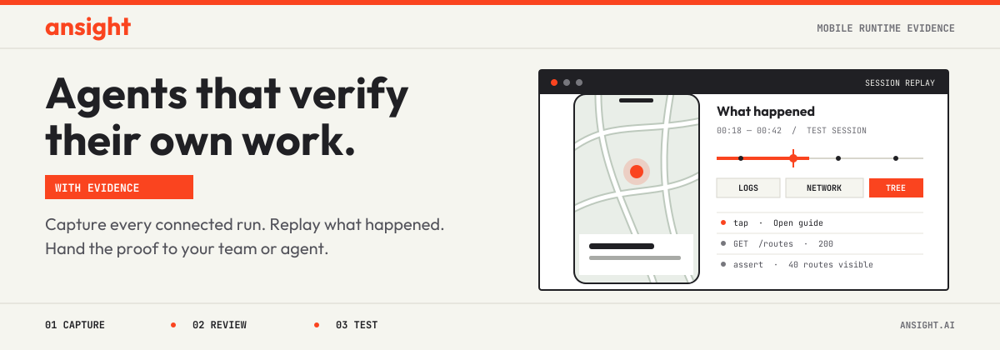

<p align="center">
  <a href="https://www.ansight.ai/"></a>
</p>

# Ansight

Ansight connects your coding agent to a running iOS or Android app. Every
connected development and test session is captured locally, so you can replay
what the agent did, inspect the runtime evidence around each action, and hand
the exact moment to a teammate or another agent. Local tools are free and need
no account.

```sh
curl -fsSL https://www.ansight.ai/install.sh | bash
ansight host run --open
```

On Windows, use the [installation guide](https://www.ansight.ai/docs/getting-started).

## Every run, recorded

An agent finishes a feature: review its test session before accepting the
change. QA finds a bug: mark the moment it happened and give the replay to a
developer or agent. The recording is already there when you need it.

## Capture, review, test

- **Capture:** Automatically retain connected sessions. Depending on the
  capture mode and SDK integration, inspect screens, touches, UI trees, logs,
  network activity, telemetry, and custom app data.
- **Review:** Scrub through a session in the local player. Mark a moment on the
  timeline or an area of the screen, then export a ZIP for a bug report or
  developer handoff.
- **Test:** Let your existing coding agent inspect and drive the app with
  [`ansight app interact`](https://www.ansight.ai/docs/cli/commands#app-interact).
  Write UI journeys and success criteria in plain language, or extract stable
  steps into repeatable local tasks. Use `ansight app execute` or a UI test run
  to hand execution and verification to Ansight's hosted agent.

Local capture, device tools, agent interaction, replay, annotations, ZIP export,
and local tasks are free. Sign in for cloud sharing, build uploads, hosted agent
execution, and remote runners.

[Website](https://www.ansight.ai) · [Documentation](https://www.ansight.ai/docs) ·
[Getting started](https://www.ansight.ai/docs/getting-started) ·
[Capture modes](https://www.ansight.ai/docs/capture-modes)

## Build

Requires .NET SDK 10.0.300 and Node.js 24 or later.

```sh
npm ci
npm run build:player
dotnet build src/Ansight.Cli/Ansight.Cli.csproj
```

See [CONTRIBUTING](CONTRIBUTING.md) for development commands.

Licensed under [PolyForm Shield 1.0.0](LICENSE). See [NOTICE](NOTICE) for
third-party notices.
